# 🚀 Erfan Nourbakhsh

    
### 🤖 Machine Learning Engineer • 💻 Software Engineer 
    

---

## 🌟 About Me

> *"Transforming complex problems into elegant solutions, one line of code at a time"*

🎯 **Mission**: Creating AI-driven innovations that bridge the gap between cutting-edge technology and real-world impact

🔥 **Currently Building**: Next-generation AI applications with PyTorch & React ecosystems

🌱 **Always Learning**: Software Architecture, Advanced PyTorch, Graph Neural Networks

🤝 **Open for Collaboration**: ML/DL Projects, Full-Stack Applications, Research Initiatives

---

## 🛠️ Tech Arsenal

### 🧠 Artificial Intelligence & Machine Learning

### 🌐 Web Development & Frontend

### 🗄️ Databases & Backend

### 🎨 Design & Tools

---

## 🏆 Expertise Highlights

<table>
<tr>
<td width="50%">

### 🤖 AI & Machine Learning
- **Deep Learning**: Advanced PyTorch implementations
- **NLP**: Natural Language Processing solutions
- **GNNs**: Graph Neural Network architectures  
- **Computer Vision**: Image processing & analysis
- **Data Science**: End-to-end ML pipelines

</td>
<td width="50%">

### 💻 Full-Stack Development  
- **Frontend**: React ecosystem mastery
- **Mobile**: React Native applications
- **Backend**: RESTful & GraphQL APIs
- **DevOps**: Docker containerization
- **UI/UX**: User-centered design approach

</td>
</tr>
</table>

---

## 📊 GitHub Analytics

---

## 🏅 Achievements & Recognition

---

## 🎯 What I'm Up To

```mermaid
graph LR
    A[🧠 AI Research] --> B[💻 Code Implementation]
    B --> C[🚀 Product Development]  
    C --> D[🌟 Impact Creation]
    D --> A
    
    style A fill:#FF6B6B,stroke:#FF6B6B,color:#fff
    style B fill:#4ECDC4,stroke:#4ECDC4,color:#fff  
    style C fill:#45B7D1,stroke:#45B7D1,color:#fff
    style D fill:#96CEB4,stroke:#96CEB4,color:#fff
```

- 🔬 **Research Focus**: Advanced Graph Neural Networks for real-world applications
- 🏗️ **Building**: AI-powered web applications with modern React architectures  
- 📚 **Learning**: Cutting-edge ML techniques and scalable software patterns
- 🤝 **Mentoring**: Sharing knowledge through open-source contributions

---

## 💡 Let's Build Something Amazing Together!

### 💬 I Love Discussing:

🧠 **Machine Learning** • 🕸️ **Graph Neural Networks** • ⚛️ **React Ecosystem** • 🏗️ **Software Architecture** • 🎨 **UI/UX Innovation**

---

### 🚀 Ready to Collaborate?

**🔗 Connect With Me**

---

### ⚡ Fun Fact
*"Best code is written with a perfect cup of tea ☕ and endless curiosity 🚀"*

**Made with ❤️ and lots of ☕**

